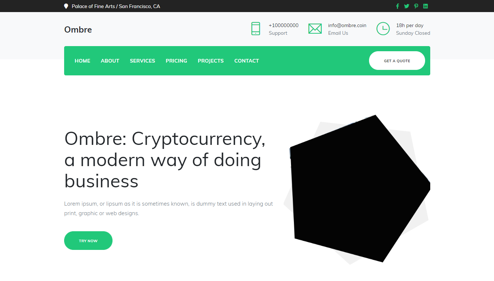

# Ombre

# Ombre Website

A repository for Ombre website available at [here](https://basemax.github.io/OmbreWebV1/).

You can watch demo of this template at [here](https://basemax.github.io/OmbreWebV1/).

## What is Ombre?

Ombre is a cryptonote currency and an indirect for of the well-known Monero currency. Inherited from Monero are strong security, privacy and untraceability features that form a solid basis for further development. Our mission is to enhance the cryptonote protocol to provide a lightweight, secure, well maintained and actively developed (no-nonsense) coin.

[Ombre website](https://ombre.network/)

-----------

### Website Dependencies

Main tools: 

- https://getbootstrap.com/
- https://jquery.com/

Secondary tools:
- https://popper.js.org/
- https://jqueryui.com/easing/
- https://kenwheeler.github.io/slick/

## Ombre: Project

All of the tools, libs and theme is free and available for all.

- **Maintainer:** [Max Base](https://github.com/BaseMax)
- **Supervisor:** [Prof. Ahmad Yoosofan](https://github.com/Yoosofan)

---------

# Max Base

My nickname is Max, Programming language developer, Full-stack programmer. I love computer scientists, researchers, and compilers.

## Asrez Team

A team includes some programmer, developer, designer, researcher(s) especially Max Base.

[Asrez Team](https://www.asrez.com/)
